# Laboratorio: Control de Acceso en Linux (MSIN4104 – Seguridad en el Host)

**Estudiante:** Diego Walles · **Modalidad:** trabajo individual · **Profesora:** Sandra Rueda
**Entorno:** GitHub Codespace (Ubuntu, Linux real) · usuario del lab: `diegowalles`

> Todas las capturas provienen de la **ejecución real** de los comandos en la terminal
> del Codespace (xterm real). Los **logs crudos** están en [`logs/`](logs) como prueba.

## Parte 1 – Reconocimiento
### 1.1–1.3 Identidad, home y ubicación
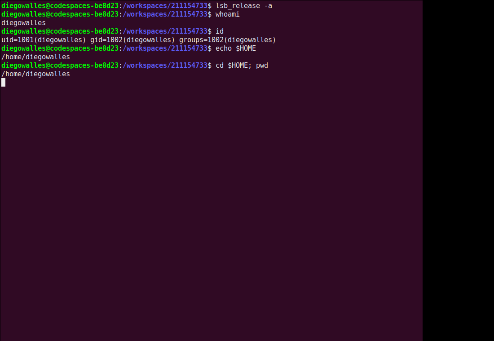
### 1.4 (*) sudo: cómo otorgarlo y ventana de validez
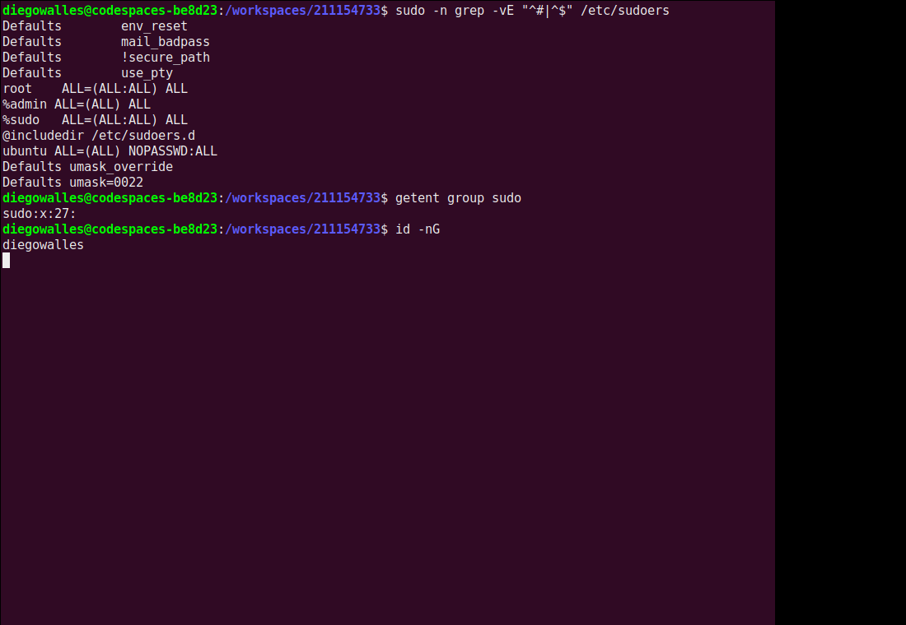
Otorgar sudo: (1) `sudo usermod -aG sudo <usuario>` + reabrir sesión (en Ubuntu `%sudo ALL=(ALL:ALL) ALL`); (2) regla con `sudo visudo`. La ventana (~15 min) equilibra usabilidad y seguridad: al expirar vuelve a pedir contraseña.
### 1.6 (*) Ventajas de sudo
Mínimo privilegio, auditoría (quién ejecutó qué), no compartir contraseña de root, granularidad, menor superficie de ataque.
### 1.7 (*) ¿sudo = modo kernel? No
`sudo` cambia identidad/privilegios de usuario (EUID=0) en modo usuario; el modo kernel es un nivel de privilegio del hardware al que se entra por interrupciones/syscalls. Conceptos ortogonales.

## Parte 2 – Autorización
### 2.1 Permisos por defecto
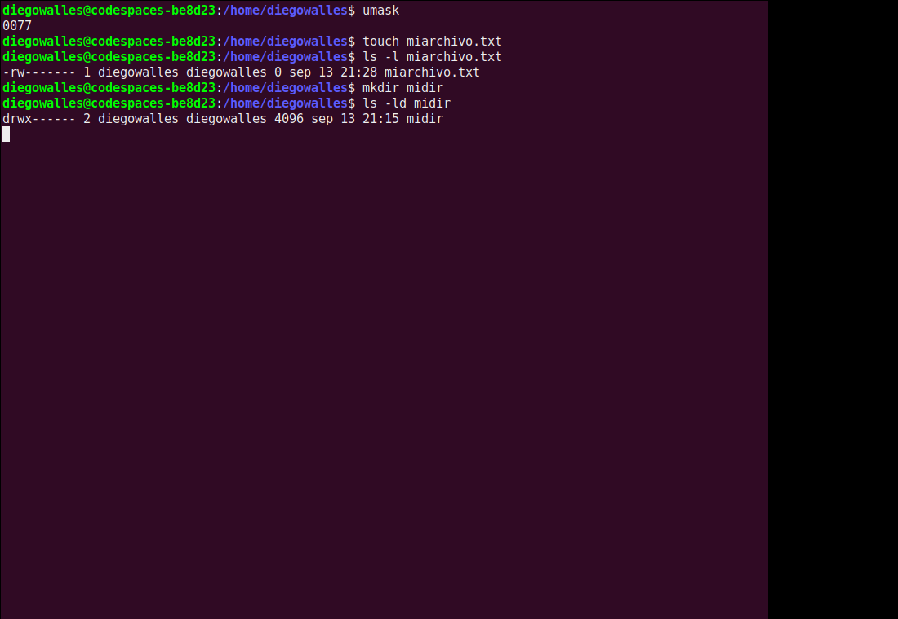
En un directorio: x=atravesar, r=listar, w=crear/borrar entradas.
### 2.2 /etc/passwd
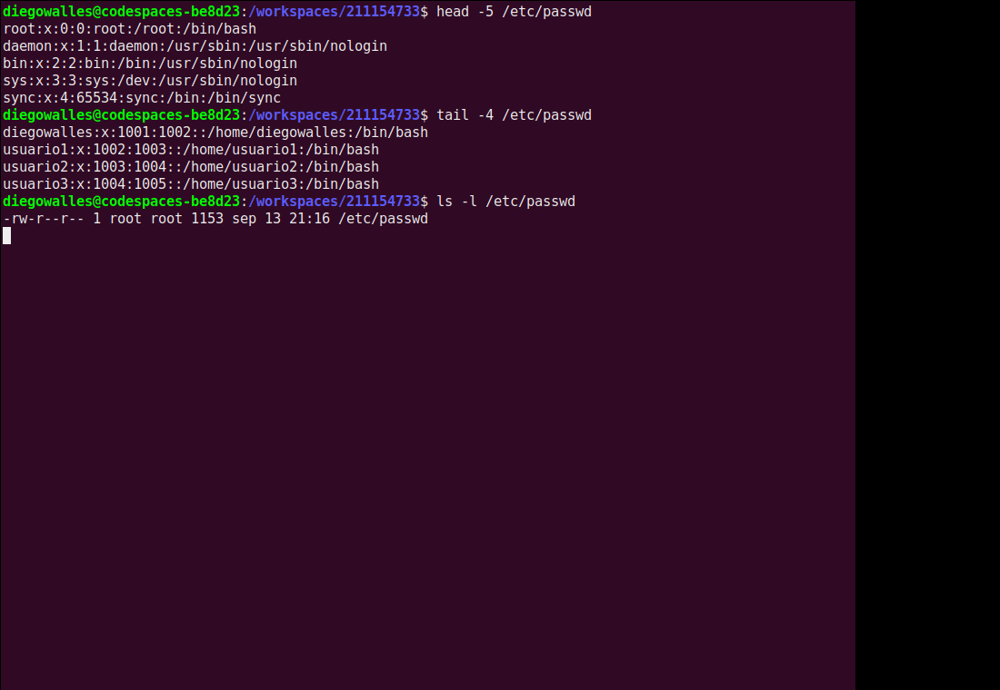
**2.2.3 (*)** Es 644 (otros: r) y debe ser legible para mapear UID↔nombre; las claves están en `/etc/shadow`.
**2.2.4 (*)** Riesgo de enumeración de cuentas (apoya fuerza bruta/phishing); no expone hashes.
### 2.3 Manejo de permisos
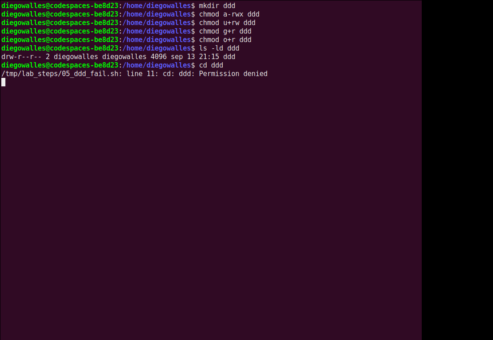
**2.3.1(d)** `cd ddd` falla: entrar requiere x.
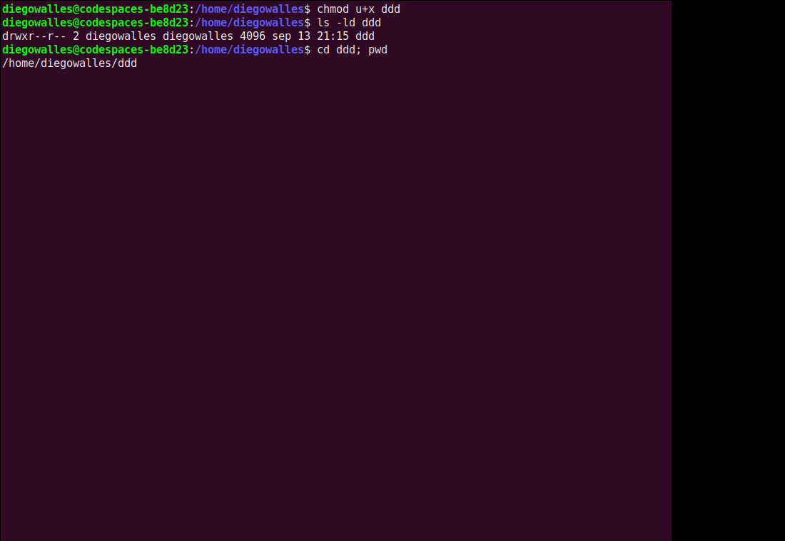
**2.3.2(c)** Con u+x, `cd ddd` funciona.
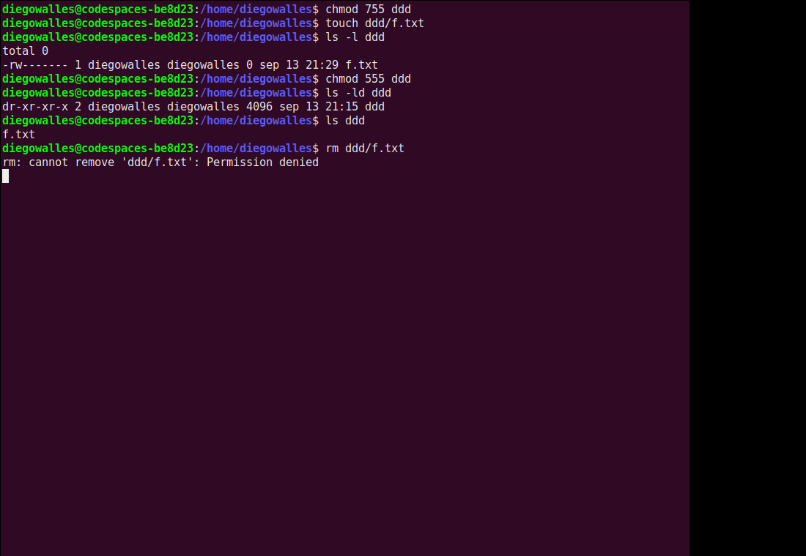
**2.3.3 (*)(d)** `ls` funciona (r-x). **(e)** `rm` falla: borrar exige **w sobre el directorio**.
### 3. Usuarios
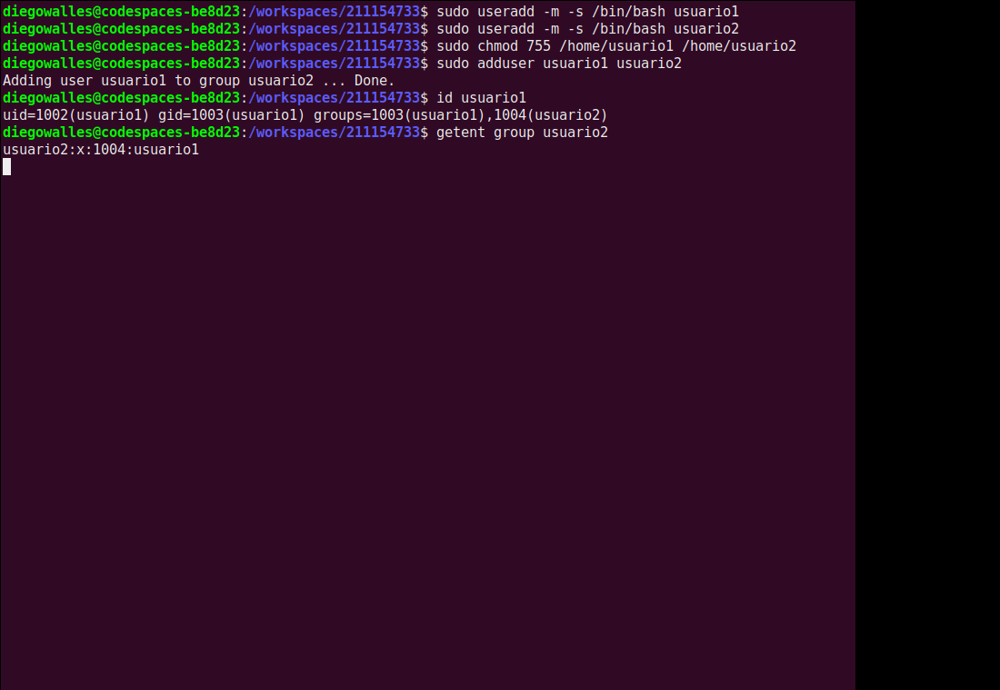
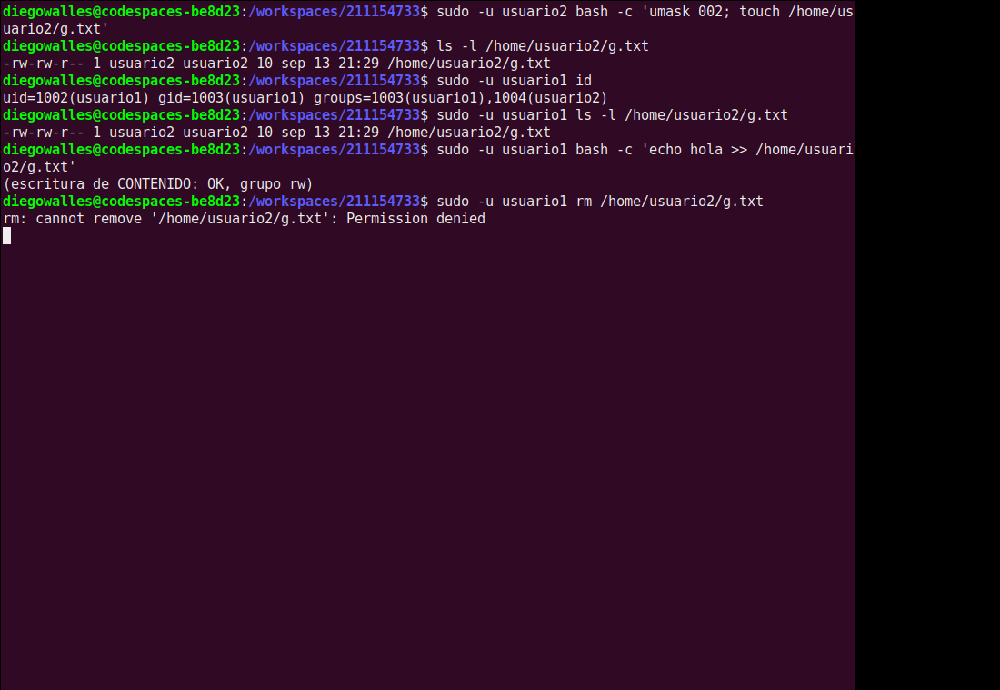
**3.6.1** `ls` funciona (usuario1 es del grupo). **3.6.2** `rm` falla (no hay w en el dir). usuario1 sí puede editar el CONTENIDO (grupo rw) pero no borrar.
### 3.7 Sal en /etc/shadow
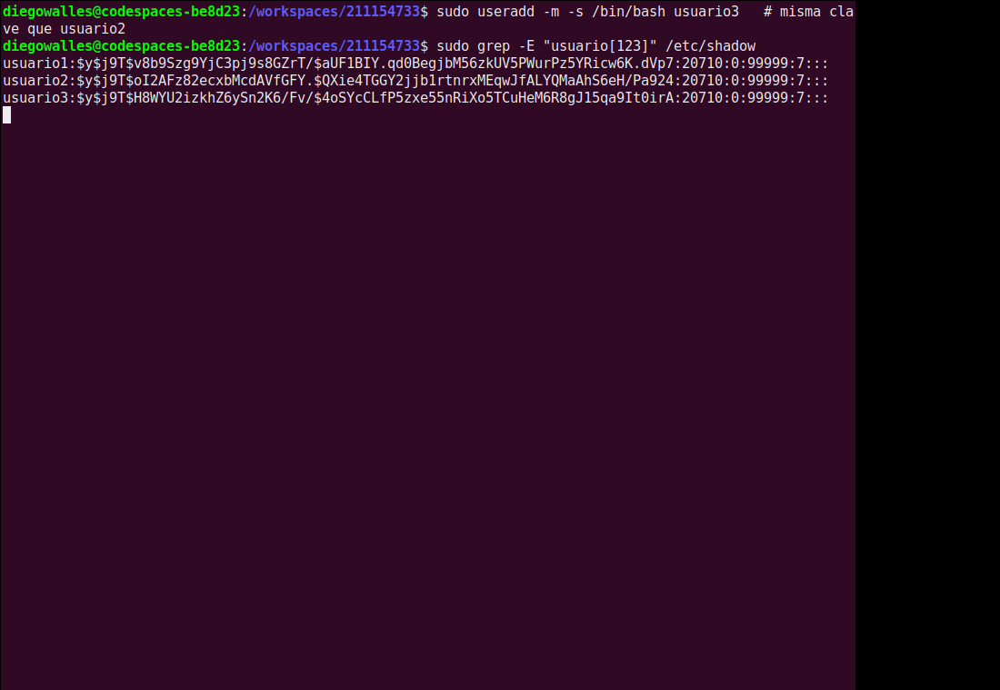
usuario2 y usuario3 tienen la MISMA clave pero hashes distintos por la **sal**.
**3.7.3 (*)** Mitiga pre-cómputo: **rainbow tables**/diccionarios precomputados.
**3.7.4 (*)** No mitiga **fuerza bruta/diccionario offline** con la sal conocida (hashcat/John); ayudan hashes lentos y claves fuertes.
### 4. Scripts
**4.1 (*)** [`permisos_archivo.sh`](permisos_archivo.sh)
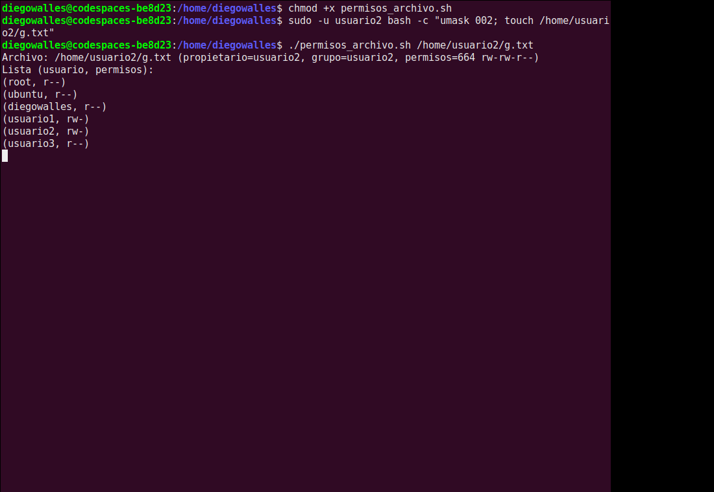
**4.2** [`usuarios_activos.sh`](usuarios_activos.sh)
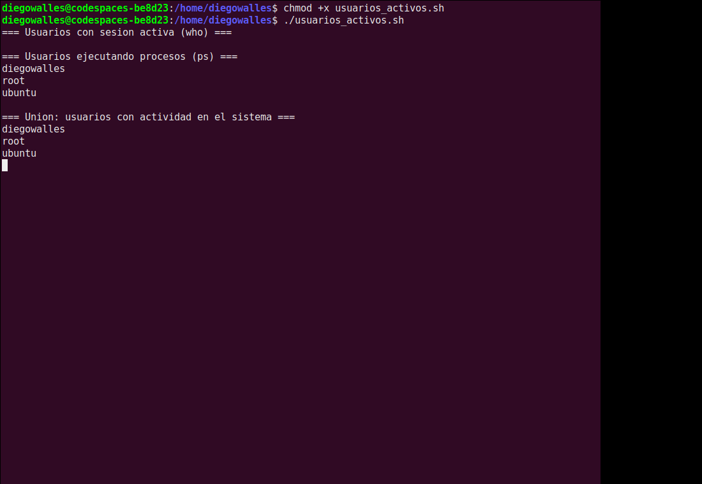
### 5. Bit s
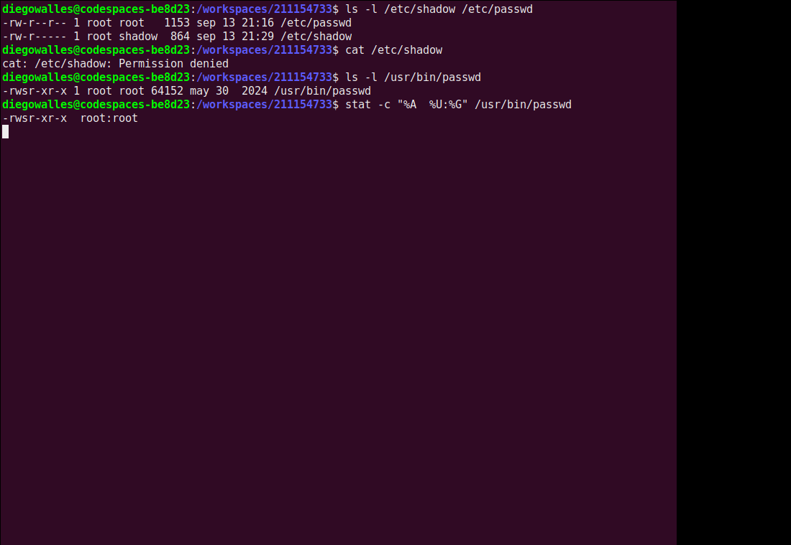
**5.1.2 (*)** `passwd` es **setuid root** (`-rwsr-xr-x`): al ejecutarlo el proceso toma EUID=root y puede escribir passwd/shadow (RUID vs EUID).
**5.1.3 (*)** Autorización interna, validación de entradas (evitar overflow), actualización atómica con bloqueo (`lckpwdf`), mínimo privilegio.

## Parte 3 – ACL
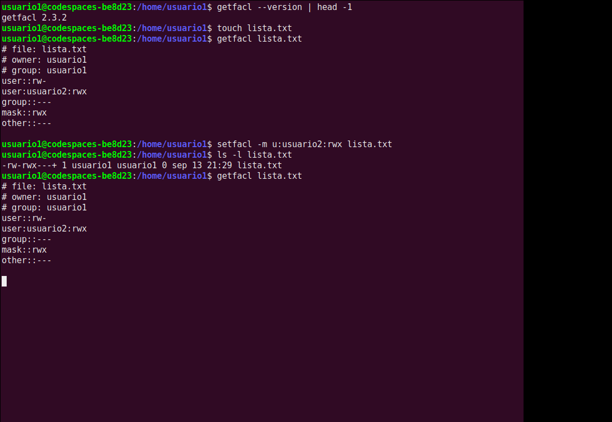
`setfacl -m u:usuario2:rwx lista.txt` añade una entrada nombrada (aparece `+` y la línea `mask`).
**7.5 (*)** Tradicional = 3 categorías; ACL = entradas por usuario/grupo específico + mask.
**7.6 (*)** Dar rwx solo a usuario2 sin tocar grupo/otros — imposible en el modelo tradicional.

## Uso de herramientas de IA generativa
Se usó un asistente de IA (MANU) para teoría, y generación inicial de scripts y captura de pruebas. Todo se **ejecutó realmente** en el Codespace, los logs en `logs/` son prueba. Aportes propios: tema, ejecución, validación y revisión contra el material del curso.
